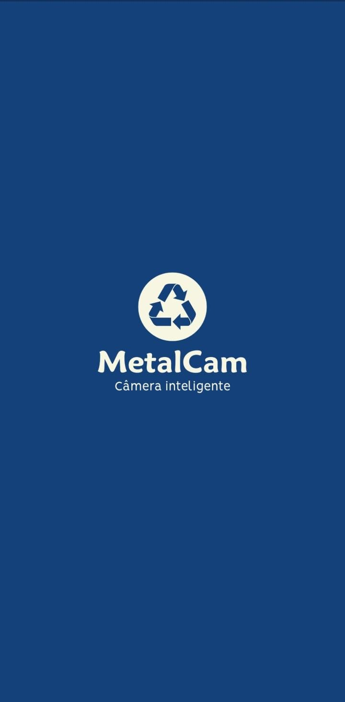
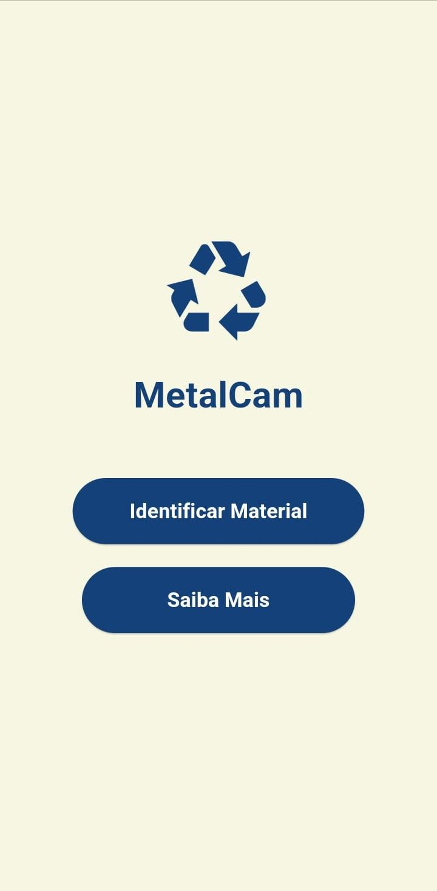
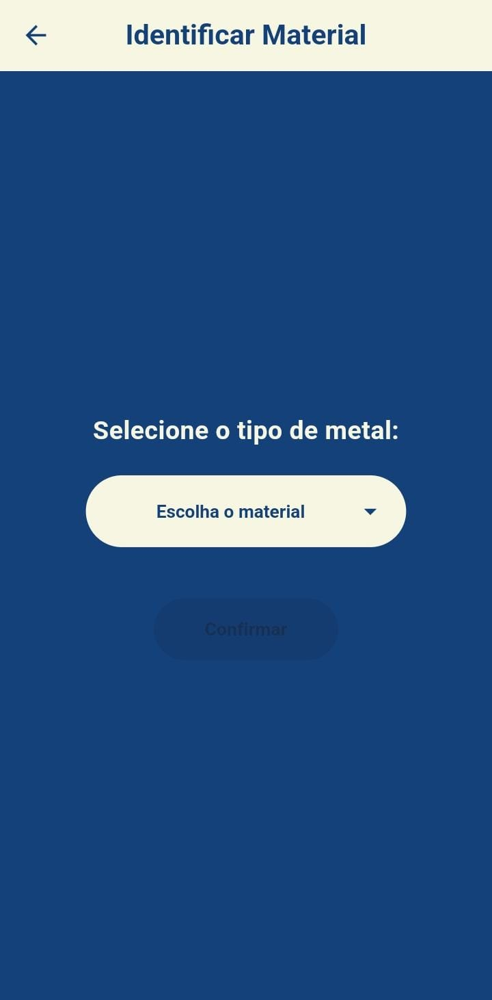
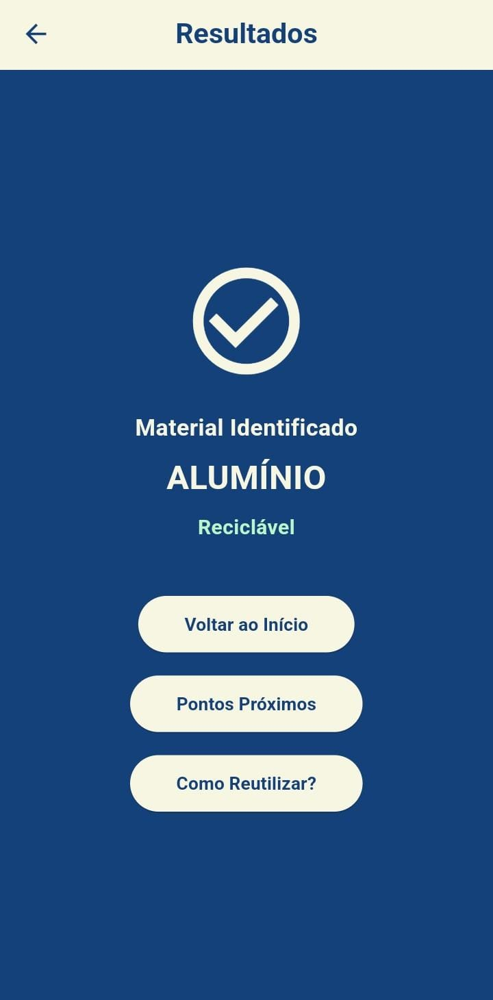
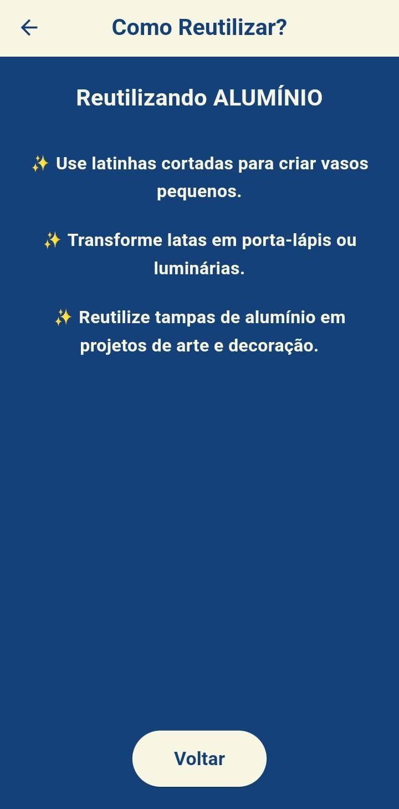

## ReciclaMetal – Identificador e Guia de Reciclagem de Metais

Aplicativo simples e intuitivo voltado para ajudar qualquer pessoa a identificar metais e aprender como descartá-los ou reutilizá-los de forma correta.

---

### Sobre o projeto

O ReciclaMetal foi desenvolvido com foco em usuários leigos, garantindo simplicidade, clareza e acessibilidade.

### Ele permite:

✔ Selecionar um tipo de metal
✔ Ver se o material é reciclável
✔ Abrir pontos de coleta próximos no Google Maps
✔ Receber dicas de reutilização
✔ Interface leve, intuitiva e com foco educacional

---

### Prévia das Telas:

### Abertura



---

### Tela Inicial (Menu)



---

### Identificar Material



---

### Resultado da Identificação



---

### Dicas de Reutilização



---

### Tecnologias utilizadas

Flutter 3

Dart 3

UI moderna baseada em Material Design

Integração com Google Maps via url_launcher


---

### Como executar o projeto

1. Clone o repositório:

git clone https://github.com/divadocode/metal-cam.git

2. Acesse a pasta:

```bash
cd reciclametal
```

3. Instale as dependências:

```bash
flutter pub get
```

4. Execute no dispositivo:

```bash
flutter run
```

---

### Gerar APK (Android)

```bash
flutter build apk --release
```

O APK final ficará em:

```bash
build/app/outputs/flutter-apk/app-release.apk
```

---

### Desenvolvido por:

Diva do Code
Desenvolvedora FullStack
@divadocode


---
